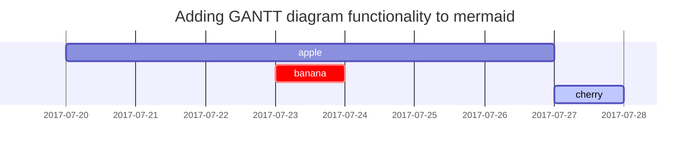

This post is to show Markdown syntax rendering on [**TSdreamer**](https://github.com/TSdreamer), you can also use it as an example of writing. Now, let's start looking at text and typography.

## Headings

# H1 - heading
{: .mt-4 .mb-0 }

## H2 - heading
{: data-toc-skip='' .mt-4 .mb-0 }

### H3 - heading
{: data-toc-skip='' .mt-4 .mb-0 }

#### H4 - heading
{: data-toc-skip='' .mt-4 }

## Paragraph

Quisque egestas convallis ipsum, ut sollicitudin risus tincidunt a. Maecenas interdum malesuada egestas. Duis consectetur porta risus, sit amet vulputate urna facilisis ac. Phasellus semper dui non purus ultrices sodales. Aliquam ante lorem, ornare a feugiat ac, finibus nec mauris. Vivamus ut tristique nisi. Sed vel leo vulputate, efficitur risus non, posuere mi. Nullam tincidunt bibendum rutrum. Proin commodo ornare sapien. Vivamus interdum diam sed sapien blandit, sit amet aliquam risus mattis. Nullam arcu turpis, mollis quis laoreet at, placerat id nibh. Suspendisse venenatis eros eros.

## Lists

### Ordered list

1. Firstly
2. Secondly
3. Thirdly

### Unordered list

- Chapter
  + Section
    * Paragraph

### ToDo list

- [ ] Job
  + [x] Step 1
  + [x] Step 2
  + [ ] Step 3

### Description list

Sun
: the star around which the earth orbits

Moon
: the natural satellite of the earth, visible by reflected light from the sun

## Block Quote

> This line shows the _block quote_.

## Prompts

> An example showing the `tip` type prompt.
{: .prompt-tip }

> An example showing the `info` type prompt.
{: .prompt-info }

> An example showing the `warning` type prompt.
{: .prompt-warning }

> An example showing the `danger` type prompt.
{: .prompt-danger }

## Tables

| University                   | Reference        | Country |
|:-----------------------------|:-----------------|--------:|
| Massachusetts Institute of Technology| Pulkit Agrawal| US |
| University of Warwick        | Sai Gu           | UK      |
| University of Birmingham     | Leandro Minku    | UK      |
| University of Nottingham     | Gavin Walker     | UK      |
| Southeast University         | Mingchun Wang    | China   |

## Links

<http://127.0.0.1:4000>

## Footnote

Click the hook will locate the footnote[^footnote], and here is another footnote[^fn-nth-2].

## Inline code

This is an example of `Inline Code`.

## Filepath

Here is the `/path/to/the/file.extend`{: .filepath}.

## Code blocks

### Common

```
This is a common code snippet, without syntax highlight and line number.
```

### Specific Language

```bash
if [ $? -ne 0 ]; then
  echo "The command was not successful.";
  #do the needful / exit
fi;
```

### Specific filename

```sass
@import
  "colors/light-typography",
  "colors/dark-typography";
```
{: file='_sass/jekyll-theme-chirpy.scss'}

## Mathematics

The mathematics powered by [**MathJax**](https://www.mathjax.org/):

$$ \sum_{n=1}^\infty 1/n^2 = \frac{\pi^2}{6} $$

When $a \ne 0$, there are two solutions to $ax^2 + bx + c = 0$ and they are

$$ x = {-b \pm \sqrt{b^2-4ac} \over 2a} $$

## Mermaid SVG




## Video



## Reverse Footnote

[^footnote]: The footnote source
[^fn-nth-2]: The 2nd footnote source
